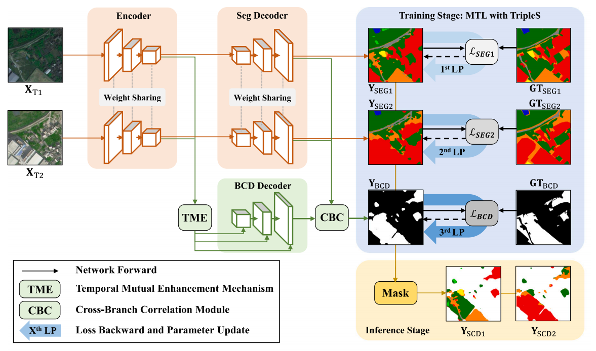
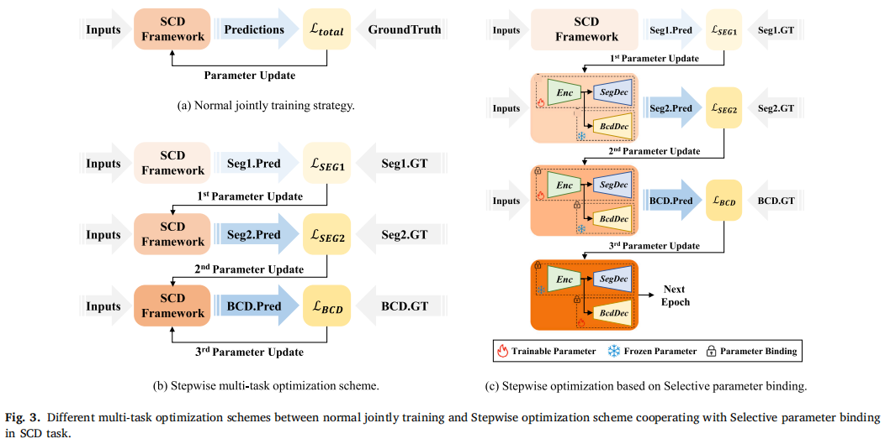
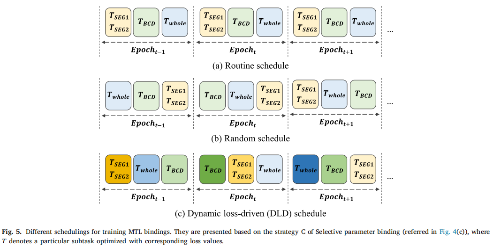
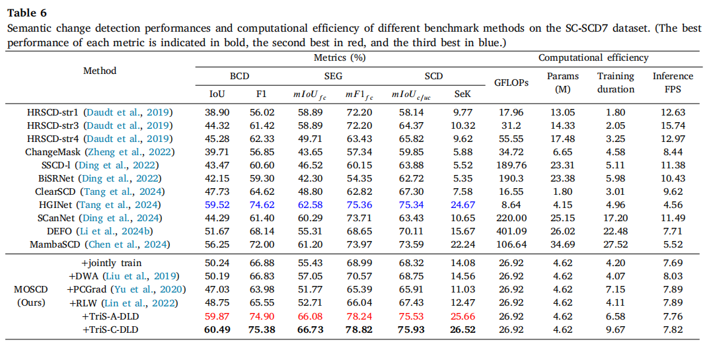
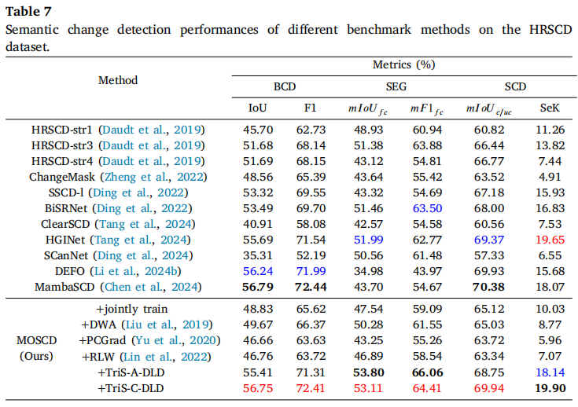

<div align="center">

# TripleS: Mitigating Multi-Task Learning Conflicts for Semantic Change Detection in High-Resolution Remote Sensing Imagery

**Language**: [English](README.md) | [中文](README_zh.md)

[](https://www.sciencedirect.com/science/article/pii/S0924271625003776)
[](https://github.com/StephenApX/MTL-TripleS)
[](https://zenodo.org/records/17218853)
[](#license)

</div>

## 📖 Overview

This repository contains the official implementation of **TripleS**, a novel multi-task learning framework for semantic change detection in high-resolution remote sensing imagery, developed by the **[CVEO team](https://github.com/cveo)** at **Wuhan University**. This work has been published in [ISPRS Journal of Photogrammetry and Remote Sensing](https://www.sciencedirect.com/science/article/pii/S0924271625003776).

### Key Contributions

- **MOSCD Model**: A Multi-Task Learning-oriented Semantic Change Detection model that mutually enhances bi-temporal features while ensuring coherent correlation across subtask branches.
- **TripleS Framework**: A comprehensive optimization framework incorporating three novel schemes:
  - **Stepwise Multi-Task Optimization**: Progressive training strategy for MTL tasks
  - **Selective Parameter Binding**: Strategic parameter sharing across tasks
  - **Dynamic Scheduling**: Adaptive training schedule for MTL bindings
- **Large-Scale Benchmarks**: Two new datasets covering diverse scenarios in China:
  - **SC-SCD7**: South China dataset with 7 semantic classes
  - **CC-SCD5**: Central China dataset with 5 semantic classes

### Research Impact

Our work addresses the fundamental challenge of conflicting objectives in multi-task learning for semantic change detection, providing a robust solution for high-resolution remote sensing applications.

## 🏗️ Architecture

### MOSCD Model
Our Multi-Task Learning-oriented Semantic Change Detection model optimized with the TripleS framework:

<div align="center">

</div>

### TripleS Framework Components

#### Stepwise Optimization with Selective Parameter Binding
<div align="center">

</div>

#### Dynamic Scheduling Strategies
<div align="center">

</div>

## 🚀 Quick Start

### Prerequisites

- Python 3.9+
- CUDA 11.6+
- PyTorch 1.12.0+

### Installation

1. **Create and activate conda environment:**
```bash
conda create -n triples python=3.9
conda activate triples
```

2. **Install dependencies:**
```bash
conda install pytorch==1.12.0 torchvision==0.13.0 cudatoolkit=11.6 pillow numpy tqdm matplotlib segmentation-models-pytorch opencv -c pytorch -c conda-forge
pip install segmentation-models-pytorch==0.3.4
```

### Dataset Preparation

#### Supported Datasets

1. **[HRSCD](https://ieee-dataport.org/open-access/hrscd-high-resolution-semantic-change-detection-dataset)** - High Resolution Semantic Change Detection Dataset
2. **[SC-SCD7 & CC-SCD5](https://zenodo.org/records/17218853)** - Our proposed large-scale benchmarks

#### Data Organization

Organize your datasets according to the structure specified in the `.txt` files located in the `/txt` directory:

```
MTL-TripleS/
├── data/
│   ├── HRSCD/
│   │   ├── train/
│   │   ├── test/
│   │   └── ...
│   ├── SCSCD7/
│   └── CCSCD5/
└── txt/
    ├── HRSCD/
    │   ├── train_HRSCD_512.txt
    │   └── test_HRSCD_512.txt
    └── ...
```

## 🔧 Training and Evaluation

### Training Options

#### 1. Joint Training
Train all tasks simultaneously:
```bash
python train_jointly.py --config_file ./configs/HRSCD/MOSCD_triS.json
```

#### 2. TripleS-A Training
Training with TripleS Alternating strategy:
```bash
python train_tripleS_A.py --config_file ./configs/SCSCD7/MOSCD_triS.json
```

#### 3. TripleS-C Training
Training with TripleS Cascaded strategy:
```bash
python train_tripleS_C.py --config_file ./configs/HRSCD/MOSCD_triS.json
```

### Model Weights
Trained model weights will be saved in the `trained_models/` directory with the following structure:
```
trained_models/
├── hrscd_512/MOSCD_triS/
├── scscd7_512/MOSCD_triS/
└── ccscd5_512/MOSCD_triS/
```

### Inference and Evaluation

Run inference and evaluation on test datasets:
```bash
python infereval.py --config_file ./configs/CCSCD5/MOSCD_triS.json \
                   --ckpt_path ./trained_models/ccscd5_512/MOSCD_triS/MOSCD_triS_1/state/checkpoint.pth.tar
```

**Output**: Prediction results will be saved in the `infer/` directory.

### Configuration Files

Each dataset has its corresponding configuration file in the `configs/` directory:
- `configs/HRSCD/MOSCD_triS.json` - HRSCD dataset configuration
- `configs/SCSCD7/MOSCD_triS.json` - SC-SCD7 dataset configuration  
- `configs/CCSCD5/MOSCD_triS.json` - CC-SCD5 dataset configuration

Key configuration parameters:
- `model`: Model architecture (MOSCD)
- `backbone`: Feature extractor (efficientnet-b0, resnet50, etc.)
- `batch_size`: Training batch size
- `learning_rate`: Learning rate for optimization
- `epochs`: Number of training epochs

## 📊 Experimental Results

### Performance on SC-SCD7 Dataset
<div align="center">

</div>

### Performance on HRSCD Dataset
<div align="center">

</div>

### Key Performance Metrics

Our TripleS framework demonstrates significant improvements across multiple evaluation metrics:

- **Change Detection**: Enhanced binary change detection accuracy
- **Semantic Segmentation**: Improved semantic class prediction for both temporal images
- **Multi-Task Efficiency**: Reduced training time while maintaining performance
- **Generalization**: Robust performance across different geographical regions and land-cover types

## 📚 Citation

If you find this work useful for your research, please consider citing our paper:

```bibtex
@article{tan2025triples,
  title={TripleS: Mitigating multi-task learning conflicts for semantic change detection in high-resolution remote sensing imagery},
  author={Tan, Xiaoliang and Chen, Guanzhou and Zhang, Xiaodong and Wang, Tong and Wang, Jiaqi and Wang, Kui and Miao, Tingxuan},
  journal={ISPRS Journal of Photogrammetry and Remote Sensing},
  volume={230},
  pages={374--401},
  year={2025},
  publisher={Elsevier},
  issn = {0924-2716},
  doi = {https://doi.org/10.1016/j.isprsjprs.2025.09.019},
}
```


## 📄 License

This code is released for **non-commercial and research purposes ONLY**. For commercial applications, please contact the authors for licensing arrangements.

## 🙏 Acknowledgments

We gratefully acknowledge the following projects and datasets that contributed to this work:

- **Code References**: 
  - [ClearSCD](https://github.com/tangkai-RS/ClearSCD) - Clear Semantic Change Detection framework
  - [torchange](https://github.com/Z-Zheng/pytorch-change-models/tree/main) - PyTorch change detection models


---

<div align="center">

**⭐ If you find this project helpful, please consider giving it a star! ⭐**

</div>
