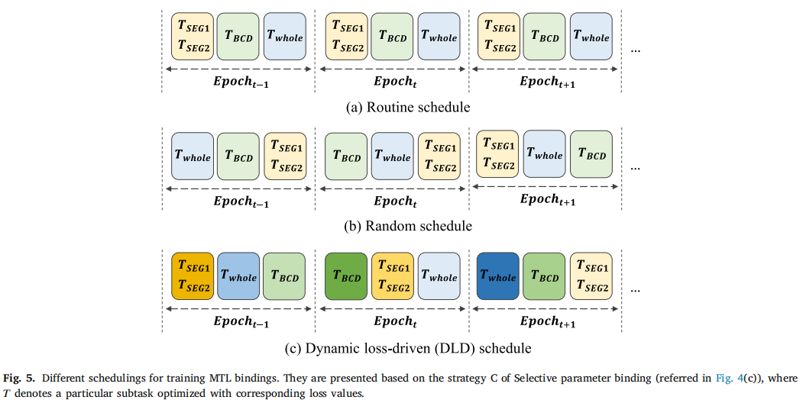
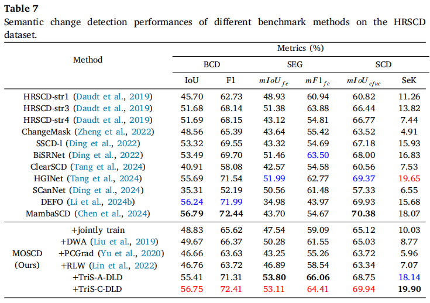

<div align="center">

# TripleS: 缓解高分辨率遥感影像语义变化检测中的多任务学习冲突

[](https://www.sciencedirect.com/science/article/pii/S0924271625003776)
[](https://github.com/StephenApX/MTL-TripleS)
[](https://zenodo.org/records/17218853)
[](#license)

</div>

## 📖 概述

本仓库包含了 **TripleS** 的官方实现，这是一个用于高分辨率遥感影像语义变化检测的新型多任务学习框架，已发表在 [ISPRS Journal of Photogrammetry and Remote Sensing](https://www.sciencedirect.com/science/article/pii/S0924271625003776)。

### 主要贡献

- **MOSCD模型**：面向多任务学习的语义变化检测模型，能够相互增强双时相特征，同时确保子任务分支间表示的一致性关联。
- **TripleS框架**：包含三个新颖方案的综合优化框架：
  - **逐步多任务优化**：MTL任务的渐进式训练策略
  - **选择性参数绑定**：跨任务的策略性参数共享
  - **动态调度**：MTL绑定的自适应训练调度
- **大规模基准数据集**：覆盖中国不同场景的两个新数据集：
  - **SC-SCD7**：华南地区数据集，包含7个语义类别
  - **CC-SCD5**：华中地区数据集，包含5个语义类别

### 研究影响

我们的工作解决了语义变化检测多任务学习中目标冲突的根本挑战，为高分辨率遥感应用提供了稳健的解决方案。

## 🏗️ 架构

### MOSCD模型
使用TripleS框架优化的面向多任务学习的语义变化检测模型：

<div align="center">

</div>

### TripleS框架组件

#### 逐步优化与选择性参数绑定
<div align="center">

</div>

#### 动态调度策略
<div align="center">

</div>

## 🚀 快速开始

### 环境要求

- Python 3.9+
- CUDA 11.6+
- PyTorch 1.12.0+

### 安装

1. **创建并激活conda环境：**
```bash
conda create -n triples python=3.9
conda activate triples
```

2. **安装依赖：**
```bash
conda install pytorch==1.12.0 torchvision==0.13.0 cudatoolkit=11.6 pillow numpy tqdm matplotlib segmentation-models-pytorch opencv -c pytorch -c conda-forge
pip install segmentation-models-pytorch==0.3.4
```

### 数据集准备

#### 支持的数据集

1. **[HRSCD](https://ieee-dataport.org/open-access/hrscd-high-resolution-semantic-change-detection-dataset)** - 高分辨率语义变化检测数据集
2. **[SC-SCD7 & CC-SCD5](https://zenodo.org/records/17218853)** - 我们提出的大规模基准数据集

#### 数据组织

根据 `/txt` 目录中 `.txt` 文件指定的结构组织数据集：

```
MTL-TripleS/
├── data/
│   ├── HRSCD/
│   │   ├── train/
│   │   ├── test/
│   │   └── ...
│   ├── SCSCD7/
│   └── CCSCD5/
└── txt/
    ├── HRSCD/
    │   ├── train_HRSCD_512.txt
    │   └── test_HRSCD_512.txt
    └── ...
```

## 🔧 训练与评估

### 训练选项

#### 1. 联合训练
同时训练所有任务：
```bash
python train_jointly.py --config_file ./configs/HRSCD/MOSCD_triS.json
```

#### 2. TripleS-A训练
使用TripleS交替策略训练：
```bash
python train_tripleS_A.py --config_file ./configs/SCSCD7/MOSCD_triS.json
```

#### 3. TripleS-C训练
使用TripleS级联策略训练：
```bash
python train_tripleS_C.py --config_file ./configs/HRSCD/MOSCD_triS.json
```

### 模型权重
训练好的模型权重将保存在 `trained_models/` 目录中，结构如下：
```
trained_models/
├── hrscd_512/MOSCD_triS/
├── scscd7_512/MOSCD_triS/
└── ccscd5_512/MOSCD_triS/
```

### 推理与评估

在测试数据集上运行推理和评估：
```bash
python infereval.py --config_file ./configs/CCSCD5/MOSCD_triS.json \
                   --ckpt_path ./trained_models/ccscd5_512/MOSCD_triS/MOSCD_triS_1/state/checkpoint.pth.tar
```

**输出**：预测结果将保存在 `infer/` 目录中。

### 配置文件

每个数据集在 `configs/` 目录中都有对应的配置文件：
- `configs/HRSCD/MOSCD_triS.json` - HRSCD数据集配置
- `configs/SCSCD7/MOSCD_triS.json` - SC-SCD7数据集配置  
- `configs/CCSCD5/MOSCD_triS.json` - CC-SCD5数据集配置

关键配置参数：
- `model`：模型架构（MOSCD）
- `backbone`：特征提取器（efficientnet-b0、resnet50等）
- `batch_size`：训练批次大小
- `learning_rate`：优化学习率
- `epochs`：训练轮数

## 📊 实验结果

### SC-SCD7数据集性能
<div align="center">

</div>

### HRSCD数据集性能
<div align="center">

</div>

### 关键性能指标

我们的TripleS框架在多个评估指标上都展现出显著改进：

- **变化检测**：增强的二值变化检测精度
- **语义分割**：改进的双时相图像语义类别预测
- **多任务效率**：在保持性能的同时减少训练时间
- **泛化能力**：在不同地理区域和土地覆盖类型上的稳健性能

## 📚 引用

如果您发现这项工作对您的研究有用，请考虑引用我们的论文：

```bibtex
@article{tan2025triples,
  title={TripleS: Mitigating multi-task learning conflicts for semantic change detection in high-resolution remote sensing imagery},
  author={Tan, Xiaoliang and Chen, Guanzhou and Zhang, Xiaodong and Wang, Tong and Wang, Jiaqi and Wang, Kui and Miao, Tingxuan},
  journal={ISPRS Journal of Photogrammetry and Remote Sensing},
  volume={230},
  pages={374--401},
  year={2025},
  publisher={Elsevier},
  issn = {0924-2716},
  doi = {https://doi.org/10.1016/j.isprsjprs.2025.09.019},
}
```


## 📄 许可证

此代码仅用于**非商业和研究目的**。如需商业应用，请联系作者获取许可安排。

## 🙏 致谢

我们衷心感谢为这项工作做出贡献的以下项目：

- **代码参考**：
  - [ClearSCD](https://github.com/tangkai-RS/ClearSCD) - 清晰语义变化检测框架
  - [torchange](https://github.com/Z-Zheng/pytorch-change-models/tree/main) - PyTorch变化检测模型

--

<div align="center">

**⭐ 如果您觉得这个项目有帮助，请考虑给它一个星标！⭐**

</div>